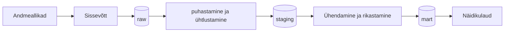

# Makseraskustes ettevõtete juhatuse muutuste varajane tuvastamine

> **Juhend:** Asenda kõik nurksulgudes vormid oma sisuga enne esitamist. Kustuta see juhendrida.

## Äriküsimus

[Kirjelda ühe-kahe lausega, millise andmetega seotud probleemi te lahendate ja kes sellest kasu saab.]
Eesmärgiks on välja selgitada, kui palju on maksuvõlas ettevõtteid, mille juhatus on muutunud viimase päeva jooksul ning milline on nende ettevõtete maksuvõla kogusumma päevase seisuga, jaotatuna võla vanuse gruppidesse (kuni 2 kuud, 2-5 kuud, 6-11 kuud, ≥ 1 aasta).
Selleks loodud juhtimislaud võimaldab saada varajase ja ajakohase ülevaate ettevõtetest, millel esinevad makseraskused koos juhatuse muutustega. Kasu saajateks on Maksu- ja Tolliamet, krdiidihalduse ettevõtted ja pankrotihaldurid, kuna juhatuse vahetus võib viidata probleemsete võlgadega ettevõtetele.

**Mõõdikud:**

1. Juhatuse muutusega maksuvõlglaste arv viimasel päeval
2. Juhatuse muutusega maksuvõlglaste maksuvõlg viimasel päeval
3. Maksuvõlglaste arv kokku viimasel päeval ?? (Kas paneme?)
4. Päevade lõikes juhatuse muutusega ettevõtete maksuvõla kogusumma võla vanuse gruppides
5. Juhatuse liikme vahetusega maksuvõlglaste nimekiri
6. Päevade lõikes juhatuse muutuse faktiga ettevõtete arv ja ettevõtete arv, kus juhatus ei muutunud (Kas paneme??)


## Arhitektuur



Täpsem kirjeldus: [`docs/arhitektuur.md`](https://github.com/KulliPeed/Projektitoo_MREV/blob/main/docs/arhitektuur.md)

## Andmestik

| Allikas | Tüüp | Ajas muutuv? | Roll |
|---------|------|--------------|------|
| [EMTA maksuvõla avaandmed](https://ncfailid.emta.ee/s/XKJLjtynFeYdGyC/download/maksuvolglaste_nimekiri.csv) | CSV | Jah, 1 kord päevas | Sisend ettevõtete maksuvõla olemasolu ja selle vanuse tuvastamisel |
| [RIK Äriregistri avaandmed, kaardile kantud isikud](https://avaandmed.ariregister.rik.ee/sites/default/files/avaandmed/ettevotja_rekvisiidid__kaardile_kantud_isikud.json.zip) | JSON | Jah, 1 kord päevas | Sisend juhatuse liikmete seoste ja nende muutuste tuvastamisel |

## Stack

| Komponent | Tööriist |
|-----------|---------|
| Sissevõtt | [Python / SQL / Bash wrapper] |
| Transformatsioon | [Python / SQL / Bash wrapper] |
| Andmehoidla | PostgreSQL |
| Näidikulaud | [Superset] |
| Orkestreerimine | [cron] |

## Käivitamine

```bash
# 1. Klooni repo ja liigu kausta
git clone <repo-url>
cd <projekti-kaust>

# 2. Kopeeri keskkonnamuutujad
cp .env.example .env
# Muuda .env failis paroolid ja muud seaded vastavalt vajadusele

# 3. Käivita teenused
docker compose up -d --build

# 4. [Vabatahtlik: käivita sissevõtt käsitsi esimesel korral]
# docker compose exec pipeline python scripts/run_pipeline.py run-all
```

Airflow (kui kasutatakse): http://localhost:8080 (kasutaja: airflow / parool: airflow)
Näidikulaud: http://localhost:[PORT]

## Saladused ja konfiguratsioon

Kõik saladused (paroolid, API võtmed, andmebaasi URL-id) on `.env` failis. Repos on ainult `.env.example`, mis näitab vajalike muutujate struktuuri ilma tegelike väärtusteta. Päris `.env` faili ei tohi GitHubi panna - see on `.gitignore`-s.

Vajalikud muutujad:

| Muutuja | Tähendus | Näide |
|---------|----------|-------|
| `DB_PASSWORD` | PostgreSQL parool | (saladus) |
| `[teised]` | ... | ... |

## Andmevoog lühidalt

1. **Sissevõtt** — [Kirjelda, kuidas andmed allikast kätte saadakse]
2. **Laadimine** — Andmed laaditakse `staging` kihti
3. **Transformatsioon** — [Kirjelda peamised arvutused ja mudelid]
4. **Testimine** — [Mitu] andmekvaliteedi testi kontrollivad korrektsust
5. **Näidikulaud** — [Kirjelda lühidalt, mida näidikulaud näitab]

## Andmekvaliteedi testid

Projekt kontrollib järgmist:

1. [Test 1 - nt: kasutajate ID on unikaalne]
2. [Test 2 - nt: tellimuse summa pole null]
3. [Test 3 - nt: kuupäev jääb vahemikku 2020-2026]
[Lisa rohkem, kui sul on]

Testide tulemused: [kuhu salvestatakse / kuidas vaadata]

## Projekti struktuur

```
.
├── README.md
├── compose.yml
├── .env.example
├── .gitignore
├── docs/
│   ├── arhitektuur.md      ← nädal 1 väljund
│   └── progress.md         ← nädal 2 väljund
└── ...                     ← ülejäänud projektifailid
```

## Kokkuvõte, puudused ja võimalikud edasiarendused

**Kokkuvõte:**
- [Loetle, mis on lõpule viidud, mis töötab hästi]

**Puudused:**
- [Loetle ausalt, mis jäi tegemata - see ei mõjuta hinnet negatiivselt, vaid aitab hinnata]

**Mis edasi:**
- [Mida tahaksid edasi teha, kui aega oleks rohkem]

## Meeskond

| Nimi | Roll |
|------|------|
| Andrus Säde | Andmeallika omanik |
| Andrus Säde/Tuuli Hani/Külli Peeduli | Transformatsioonide omanik |
| Tuuli Hani/Külli Peeduli | Kvaliteedi omanik |
| Külli Peeduli/Tuuli Hani | Näidikulaua omanik |

Iga rolli juurde märgitud esimene isik on põhivastutaja ja teised märgitud on kaasvastutajad
