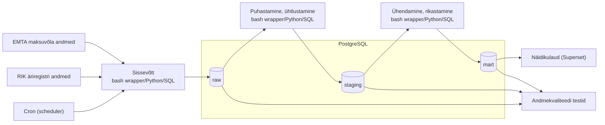

# Makseraskustes ettevõtete juhatuse muutuste varajane tuvastamine

## Äriküsimus

Eesmärgiks on välja selgitada, kui palju on maksuvõlas ettevõtteid, mille juhatus on muutunud viimase päeva jooksul ning milline on nende ettevõtete maksuvõla kogusumma päevase seisuga, jaotatuna võla vanuse gruppidesse (kuni 2 kuud, 2-5 kuud, 6-11 kuud, ≥ 1 aasta).
Selleks loodud juhtimislaud võimaldab saada varajase ja ajakohase ülevaate ettevõtetest, millel esinevad makseraskused koos juhatuse muutustega ning jälgida selliste ettevõtete arvu ja jaotust ajas. Püstitus on maksuhalduri vajadusest lähtuvalt ent võimalik on võtta kasutusele ka ettevõtetes sidudes kliendibaasiga ja hinnata seeläbi varakult riske kliendi käitumises. Kasu saajateks on Maksu- ja Tolliamet, ettevõtted, krediidihalduse ettevõtted ja pankrotihaldurid, kuna juhatuse vahetus võib viidata probleemsete võlgadega ettevõtetele. 

**Mõõdikud:**

1. Juhatuse muutusega maksuvõlglaste arv viimase päeva seisuga.
2. Juhatuse muutusega maksuvõlglaste maksuvõlg viimase päeva seisuga.
3. Maksuvõlglaste arv kokku viimase päeva seisuga.
4. Viimase 7 päeva lõikes juhatuse muutusega ettevõtete maksuvõla kogusumma võla vanuse gruppides.
5. Viimase päeva seisuga juhatuse liikme vahetusega maksuvõlglaste nimekiri.
6. Viimase 7 päeva kohta juhatuse muutusega ja muutusteta maksuvõlglaste arv.


## Arhitektuur



Täpsem kirjeldus: [`docs/arhitektuur.md`](https://github.com/KulliPeed/Projektitoo_MREV/blob/main/docs/arhitektuur.md)

## Andmestik

| Allikas | Tüüp | Ajas muutuv? | Roll |
|---------|------|--------------|------|
| [EMTA maksuvõla avaandmed](https://ncfailid.emta.ee/s/XKJLjtynFeYdGyC/download/maksuvolglaste_nimekiri.csv) | CSV | Jah, 1 kord päevas | Sisend ettevõtete maksuvõla olemasolu ja selle vanuse tuvastamisel |
| [RIK Äriregistri avaandmed, kaardile kantud isikud](https://avaandmed.ariregister.rik.ee/sites/default/files/avaandmed/ettevotja_rekvisiidid__kaardile_kantud_isikud.json.zip) | JSON | Jah, 1 kord päevas | Sisend juhatuse liikmete seoste ja nende muutuste tuvastamisel |

## Stack

| Komponent | Tööriist |
|-----------|---------|
| Sissevõtt | [Python / SQL / Bash wrapper] |
| Transformatsioon | [Python / SQL / Bash wrapper] |
| Andmehoidla | PostgreSQL |
| Näidikulaud | [Superset] |
| Orkestreerimine | [cron] |

## Käivitamine

```bash
# 1. Klooni repo ja liigu kausta
git clone <repo-url>
cd <projekti-kaust>

# 2. Kopeeri keskkonnamuutujad
cp .env.example .env
# Muuda .env failis paroolid ja muud seaded vastavalt vajadusele

# 3. Käivita teenused
docker compose up -d --build

# 4. [Vabatahtlik: käivita sissevõtt käsitsi esimesel korral]
# docker compose exec pipeline python scripts/run_pipeline.py run-all
```

Airflow (kui kasutatakse): http://localhost:8080 (kasutaja: airflow / parool: airflow)
Näidikulaud: http://localhost:[PORT]

## Saladused ja konfiguratsioon

Kõik saladused (paroolid, API võtmed, andmebaasi URL-id) on `.env` failis. Repos on ainult `.env.example`, mis näitab vajalike muutujate struktuuri ilma tegelike väärtusteta. Päris `.env` faili ei tohi GitHubi panna - see on `.gitignore`-s.

Vajalikud muutujad:

| Muutuja | Tähendus | Näide |
|---------|----------|-------|
| `DB_PASSWORD` | PostgreSQL parool | (saladus) |
| `[teised]` | ... | ... |

## Andmevoog lühidalt

1. **Sissevõtt** — [Kirjelda, kuidas andmed allikast kätte saadakse]
2. **Laadimine** — Andmed laaditakse `raw` kihti
3. **Transformatsioon** — [Kirjelda peamised arvutused ja mudelid]
4. **Testimine** — 18 andmekvaliteedi testi erinevate kihtide (raw, staging, mart) andmete kontrollimiseks, mis salvestuvad tabelisse quality.data_quality_results ja kuvatakse ka dashboardil.
5. **Näidikulaud** — Näidikulaud näitab viimase päeva juhatuse vahetusega maksuvõlgnike nimekirja, juhatuse vahetusega ettevõtete arvu ja maksuvõlga, nende muutust ajas ning maksuvõlga maksuvõla vanusegruppides. Lisaks ka andmekvaliteedi testide tulemused.

## Andmekvaliteedi testid

Projekt kontrollib järgmist:

| Testi number | Testi nimi                       | Testi sõnum                                                                 | DB kiht    | Allikas    |
|--------------|----------------------------------|-------------------------------------------------------------------------------|------------|------------|
| TEST 1       | fact_foreign_key_integrity       | FACT tabelis leidub võõrvõtmeid, millel puudub vaste dimensioonides.         | FACT       | MART_STAR  |
| TEST 2       | raw_data_as_of_idempotent        | RAW kihis on mitu snapshoti sama kuupäevaga.                                 | RAW        | MTA        |
| TEST 3       | raw_rik_download_success         | RIK andmete allalaadimine ebaõnnestus või ridade arv puudub.                 | RAW        | RIK        |
| TEST 4       | rik_raw_stage_parity             | RIK RAW ja STAGE ridade arv ei klapi.                                        | RAW_STAGE  | RIK        |
| TEST 5       | stage_fact_maksuvolg_sum_parity  | Maksuvõla summa STAGE ja FACT kihis ei klapi lubatud piirides.               | STAGE_FACT | MTA        |
| TEST 6       | stage_rik_bad_registrikood       | RIK registrikood ei vasta formaadile või on tühi.                             | STAGE      | RIK        |
| TEST 7       | stage_rik_duplicate_registrikood | RIK snapshotis esineb duplikaatregistrikoode.                                 | STAGE      | RIK        |
| TEST 8       | stage_mta_negative_maksuvolg     | MTA maksuvõlg sisaldab negatiivseid väärtusi.                                 | STAGE      | MTA        |
| TEST 9       | mart_star_snapshot_parity        | FACT snapshotide arv ei klapi STAGE snapshotidega.                            | MART_STAR  | MART_STAR  |
| TEST 10      | raw_mta_date_fields_not_null     | MTA andmetes puuduvad kuupäevaväljad või sisaldavad NULL väärtusi.            | RAW        | MTA        |
| TEST 11      | stage_mta_bad_registrikood       | MTA registrikood ei vasta formaadile või puudub.                              | STAGE      | MTA        |
| TEST 12      | fact_grain_uniqueness            | FACT tabelis esineb duplikaatridu sama ettevõtte ja kuupäeva kohta.           | FACT       | MART_STAR  |
| TEST 13      | stage_mta_null_maksuvolg         | MTA maksuvõlg sisaldab NULL väärtusi.                                         | STAGE      | MTA        |
| TEST 14      | raw_mta_download_success         | MTA andmete allalaadimine ebaõnnestus või ridade arv puudub.                 | RAW        | MTA        |
| TEST 15      | raw_source_structure_consistency | Allikandmete struktuur või veerunimed on muutunud.                            | RAW        | RIK        |
| TEST 16      | mta_raw_stage_parity             | MTA RAW ja STAGE ridade arv ei klapi.                                         | RAW_STAGE  | MTA        |
| TEST 17      | mart_star_required_columns       | MART_STAR veerud puuduvad.                                                    | MART_STAR  | MART_STAR  |
| TEST 18      | fact_juhatuse_muutuse_not_null   | FACT tabelis juhatuse_muutuse_fakt sisaldab NULL väärtusi.                   | FACT       | MART_STAR  |

Testide tulemused: salvestatakse quality.data_quality_results tabelisse ja on nähtavad dashboardil.

## Projekti struktuur

```
.
├── README.md
├── compose.yml
├── .env.example
├── .gitignore
├── docs/
│   ├── arhitektuur.md      ← nädal 1 väljund
│   └── progress.md         ← nädal 2 väljund
└── ...                     ← ülejäänud projektifailid
```

## Kokkuvõte, puudused ja võimalikud edasiarendused

**Kokkuvõte:**
- [Loetle, mis on lõpule viidud, mis töötab hästi]
- Soovitud andmevoog toimib otsast lõpuni ja on terviklik (andmed laetakse automaatselt andmebaasi ja tulemid kajastuvad juhtimislaual).
- Juhtimislaud kajastab õiget tulemit, vastab äriküsimusele ja kuvab ajas muutuvust.
- Piisaval hulgal andmekvaliteedi kontrolle on loodud ja toovad välja olulisemad esineda võivad andmekvaliteedi probleemid juhtimislaual.
- Töövoog on idempotentne ja korratav.

**Puudused:**
- [Loetle ausalt, mis jäi tegemata - see ei mõjuta hinnet negatiivselt, vaid aitab hinnata]
- Kvaliteedi testid toovad välja mõningad probleemid mida ei peaks lugema veaks (nendega ei jõudnud tegeleda): nt. MTA andmed ei vasta formaadile aga MTA andmetes registrikood ei pea olema numbri formaadis, kuna nende hulgas esineb ka mitteresidente, kelle registrikood algab tähekombinatsiooniga. Andmekvaliteedi test "stage_mta_bad_registrikood" loeb sellised hetkel veaks.
- Skriptide puhastamisega ei jõudnud tegeleda

**Mis edasi:**
- [Mida tahaksid edasi teha, kui aega oleks rohkem]
- kõrvaldaks eelpool nimetatud puudused

## Meeskond

| Nimi | Roll |
|------|------|
| Andrus Säde | Andmeallika omanik |
| Andrus Säde/Tuuli Hani/Külli Peeduli | Transformatsioonide omanik |
| Tuuli Hani/Külli Peeduli | Kvaliteedi omanik |
| Külli Peeduli/Tuuli Hani | Näidikulaua omanik |

Iga rolli juurde märgitud esimene isik on põhivastutaja ja teised märgitud on kaasvastutajad
