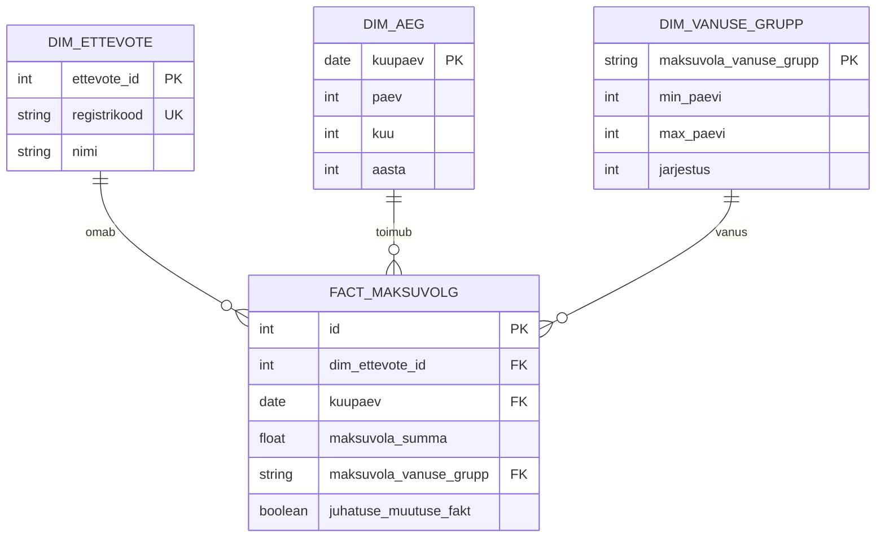

# MART_STAR tähtmudel

Andmebaasis on lõplik tähtskeem skeemis `mart_star`.

Tabelid:

- `mart_star.dim_ettevote`
- `mart_star.dim_aeg`
- `mart_star.dim_vanuse_grupp`
- `mart_star.fact_maksuvolg`

| README1 objekt | Füüsiline objekt |
| --- | --- |
| `DIM_AEG` | `mart_star.dim_aeg` |
| `DIM_ETTEVOTE` | `mart_star.dim_ettevote` |
| `DIM_VANUSE_GRUPP` | `mart_star.dim_vanuse_grupp` |
| `FACT_MAKSUVOLG` | `mart_star.fact_maksuvolg` |

## Faktitabeli Grain

`mart_star.fact_maksuvolg` grain:

```text
üks rida = üks ettevõte + üks MTA snapshot_date
```

`kuupaev` faktitabelis tähendab MTA snapshoti kuupäeva.

Kui ühel registrikoodil on samas MTA snapshotis mitu rida, koondatakse need üheks faktireaks registrikoodi ja snapshot-kuupäeva lõikes.

`FACT_MAKSUVOLG.juhatuse_muutuse_fakt` on boolean tunnus. See arvutatakse STAGE RIK juhatuse liikmete snapshotite põhjal: iga MTA snapshoti kuupäeva jaoks leitakse lähim sama päeva või varasem RIK snapshot ja võrreldakse seda sellele eelneva RIK snapshotiga. Kui võrdlust teha ei saa, jääb väärtus `false`.

## ER Skeem



## Füüsilised Veerud

`mart_star.dim_ettevote`:

- `ettevote_id`
- `registrikood`
- `nimi`

`mart_star.dim_aeg`:

- `kuupaev`
- `paev`
- `kuu`
- `aasta`

`mart_star.dim_vanuse_grupp`:

- `maksuvola_vanuse_grupp`
- `min_paevi`
- `max_paevi`
- `jarjestus`

`mart_star.fact_maksuvolg`:

- `id`
- `dim_ettevote_id`
- `kuupaev`
- `maksuvola_summa`
- `maksuvola_vanuse_grupp`
- `juhatuse_muutuse_fakt`
