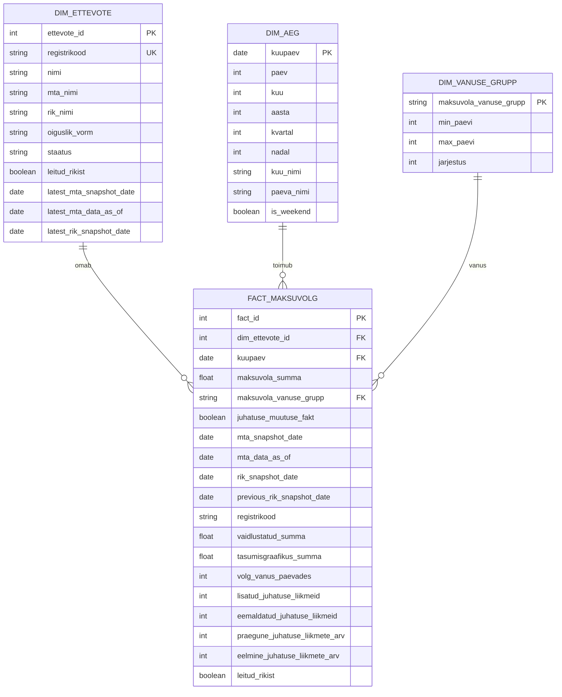

# MART_STAR tähtmudel

Tähtmudel on andmebaasis skeemis `mart_star`.

| README1 objekt | Füüsiline objekt |
| --- | --- |
| `DIM_AEG` | `mart_star.dim_aeg` |
| `DIM_ETTEVOTE` | `mart_star.dim_ettevote` |
| `DIM_VANUSE_GRUPP` | `mart_star.dim_vanuse_grupp` |
| `FACT_MAKSUVOLG` | `mart_star.fact_maksuvolg` |

Olemasolev `mart` skeem sisaldab dashboard'i jaoks loodud vaateid ja Superseti cache tabeleid. `mart_star` on eraldi dimensioonmudel, mis vastab allolevale ER skeemile ega asenda praegust Superseti dashboard'i kihti.

## Faktitabeli grain

`mart_star.fact_maksuvolg` grain:

```text
üks rida = üks ettevõte + üks MTA snapshot_date.
```

`FACT_MAKSUVOLG.kuupaev` vastab MTA `snapshot_date` väärtusele. `mta_data_as_of` on faktitabelis lisainfo veerg, kuid graini ei määra. Kui ühel registrikoodil on samas MTA snapshotis mitu rida, koondatakse need üheks faktireaks registrikoodi ja snapshot-kuupäeva lõikes.

`FACT_MAKSUVOLG.juhatuse_muutuse_fakt` arvutatakse `stage.rik_kaardile_kantud_isikud` põhjal. Iga MTA snapshoti kuupäeva D kohta võrreldakse RIK juhatuse liikmete seisu kuupäeval D ja kuupäeval D-1. Kui ettevõttel lisandus juhatuse liige või varasem juhatuse liige puudub D päeval, siis `juhatuse_muutuse_fakt = true`. Kui RIK D/D-1 võrdlust ei saa teha, jääb faktirida alles ja väärtus on `false`.

## ER skeem

Mermaid diagramm kasutab kontseptuaalseid README1 nimesid. Füüsilised tabelid on ülal olevas vastavustabelis.



## Superseti kasutus

Olemasolev Superseti dashboard võib jätkata `mart.v_*` vaadete ja `mart.superset_cache_*` tabelite kasutamist.

Kui soovitakse näidata klassikalist tähtmudelit, saab Supersetisse lisada uued datasetid:

- `mart_star.dim_ettevote`
- `mart_star.dim_aeg`
- `mart_star.dim_vanuse_grupp`
- `mart_star.fact_maksuvolg`
