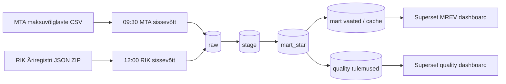

# MREV — Maksuvõlglaste ja juhatuse muutuste andmepipeline

## Äriküsimus

MREV projekt aitab hinnata, millistel maksuvõlaga ettevõtetel on juhatuse koosseisus toimunud muutusi ning kuidas maksuvõlg ja juhatuse muutused ajas ja vanusegruppides jaotuvad. Lahendus on mõeldud andmeanalüütikule, projektijuhile ja Superseti kasutajale, kes peab nägema usaldusväärset ülevaadet MTA ja RIK andmete põhjal.

**Mõõdikud:**

1. Maksuvõlglaste arv viimase andmeseisu järgi.
2. Maksuvõlg kokku ja jaotus vanusegruppide kaupa.
3. Maksuvõlglaste arv ja võlasumma nende ettevõtete lõikes, kus juhatus on muutunud.

## Arhitektuur



Täpsem tehniline juhend: `docs/MREV_pipeline_konfiguratsioonid_cronid_ja_README_juhend.pdf`.

## Andmestik

| Allikas | Tüüp | Ajas muutuv? | Roll |
|---|---|---:|---|
| MTA maksuvõlglaste nimekiri | CSV fail veebilehe kaudu | Jah, igapäevane | Põhiandmevoog maksuvõla info jaoks |
| RIK Äriregistri ettevõtjate ja kaardile kantud isikute andmed | JSON ZIP fail | Jah, igapäevane snapshot | Ettevõtete ja juhatuse liikmete taustandmed |
| `admin.raw_import_audit` | PostgreSQL audititabel | Jah, iga impordi kohta | Sissevõtu idempotentsuse ja edukuse kontroll |
| `quality.*` tabelid | PostgreSQL kvaliteedikontrollide tulemused | Jah, iga quality run'i kohta | Andmekvaliteedi jälgimine ja Superseti quality dashboard |

## Stack

| Komponent | Tööriist |
|---|---|
| Sissevõtt | Python skriptid + cron |
| Transformatsioon | PostgreSQL SQL migratsioonid ja refresh skriptid |
| Andmehoidla | PostgreSQL 16 Docker konteineris |
| Näidikulaud | Apache Superset Docker konteineris |
| Admin-vaade | Adminer |
| Orkestreerimine | Linux cron `pi` kasutaja all |
| Andmekvaliteet | Python runner `scripts/run_data_quality_checks.py` + `quality` skeem |

## Käivitamine

```bash
# 1. Liigu live projektikausta
cd /home/pi/kool/projekt

# 2. Käivita PostgreSQL ja Adminer
docker compose up -d

# 3. Käivita Superset
docker compose -f docker-compose.superset.yml up -d --build

# 4. Kontrolli konteinereid
docker ps

# 5. Käivita vajadusel päevane MTA töö käsitsi
DB_PASSWORD=<redacted> ./scripts/paevane_mta_maksuvolglased.sh

# 6. Käivita vajadusel päevane RIK töö käsitsi
DB_PASSWORD=<redacted> ./scripts/paevane_rik_snapshot.sh

# 7. Käivita RAW -> STAGE -> MART_STAR refresh
./scripts/paevane_pipeline_refresh.sh

# 8. Käivita quality runner käsitsi
DB_PASSWORD=<redacted> ./.venv/bin/python scripts/run_data_quality_checks.py
```

Superset: `http://<raspberry-pi-ip>:8088`  
Adminer: `http://<raspberry-pi-ip>:8080`  
PostgreSQL: `<raspberry-pi-ip>:5432`

## Cron ajastus

Cron töötab `pi` kasutaja all. Kontroll:

```bash
crontab -u pi -l
```

Praegune päevane ahel:

```cron
# MTA maksuvõlglaste CSV allalaadimine ja PostgreSQL RAW import iga päev kell 09:30
30 9 * * * /home/pi/kool/projekt/scripts/paevane_mta_maksuvolglased.sh

# RIK Äriregistri snapshot allalaadimine ja PostgreSQL RAW import iga päev kell 12:00
0 12 * * * /home/pi/kool/projekt/scripts/paevane_rik_snapshot.sh

# RAW -> STAGE -> MART_STAR värskendus iga päev pärast RIK laadimist
30 13 * * * /home/pi/kool/projekt/scripts/paevane_pipeline_refresh.sh >/dev/null 2>&1
```

## Saladused ja konfiguratsioon

Kõik paroolid, secret key väärtused ja andmebaasi DSN-id peavad olema `.env` või `.env.superset` failides. Päris `.env` ja `.env.superset` faile ei tohi GitHubi commit'ida. Repos peab olema ainult näidisfail, näiteks `.env.superset.example`.

| Muutuja | Tähendus | Näide |
|---|---|---|
| `DB_PASSWORD` või `POSTGRES_PASSWORD` | PostgreSQL parool raw loaderite ja quality runneri jaoks | `<redacted>` |
| `RUN_DATA_QUALITY_CHECKS` | Kas 13:30 pipeline käivitab quality runneri | `false` vaikimisi, `true` kui vaja |
| `DATA_QUALITY_FAIL_PIPELINE` | Kas quality FAIL katkestab pipeline'i | `false` vaikimisi |
| `SUPERSET_SECRET_KEY` | Superseti secret key | `<redacted>` |
| `SUPERSET_METADATA_DB_URI` | Superseti metadata DB SQLAlchemy DSN | `<redacted>` |
| `SUPERSET_READONLY_DB_USER` | Superseti lugemisroll | `superset_readonly` |
| `SUPERSET_READONLY_DB_PASSWORD` | Superseti lugemisrolli parool | `<redacted>` |

## Andmevoog lühidalt

1. **Sissevõtt** - MTA CSV ja RIK JSON ZIP laaditakse alla ning imporditakse RAW kihti.
2. **Idempotentsus** - RAW import kontrollib snapshot'i olemasolu ja logib tegevuse `admin.raw_import_audit` tabelisse.
3. **STAGE** - `refresh_stage_incremental.sh` leiab puuduvad RAW snapshotid ja värskendab ainult vajalikud kuupäevad.
4. **MART_STAR** - `refresh_mart_star.sh` ehitab faktitabeli ja dimensioonid stage andmete põhjal.
5. **Freshness kontroll** - pipeline kontrollib, kas RAW, STAGE ja FACT on samal kuupäeval ja snapshotide arvud klapivad.
6. **Andmekvaliteet** - `run_data_quality_checks.py` kirjutab tulemused `quality` skeemi. Vaikimisi ei katkesta andmekvaliteedi FAIL pipeline'i.
7. **Näidikulaud** - Superset loeb `mart`, `mart_star` ja `quality` vaateid.

## Andmekvaliteedi testid

Projektis on realiseeritud 19 andmekvaliteedi kontrolli. Näited kursuse miinimumnõude täitmiseks:

1. `stage_mta_null_maksuvolg` - not null test: MTA maksuvõlg ei tohi olla `NULL`.
2. `stage_mta_negative_maksuvolg` - väärtuse vahemiku test: MTA maksuvõlg ei tohi olla negatiivne.
3. `fact_grain_uniqueness` - unikaalsuse test: faktitabelis ei tohi olla mitu rida sama ettevõtte ja kuupäeva kohta.
4. `stage_fact_maksuvolg_sum_parity` - äriloogika test: stage ja fact maksuvõla summad peavad klappima lubatud erinevuse piires.

Testide tulemused salvestatakse:

- `quality.data_quality_runs`
- `quality.data_quality_results`
- `quality.data_quality_bad_rows`
- `quality.source_structure_snapshots`

Supersetis kasutatakse vaateid:

- `quality.v_data_quality_latest`
- `quality.v_data_quality_history`
- `quality.v_data_quality_summary`
- `quality.v_data_quality_bad_rows`

## Projekti struktuur

```text
.
├── README.md
├── docker-compose.yml
├── docker-compose.superset.yml
├── .env.superset.example
├── scripts/
│   ├── paevane_mta_maksuvolglased.sh
│   ├── paevane_rik_snapshot.sh
│   ├── paevane_pipeline_refresh.sh
│   ├── refresh_stage_incremental.sh
│   ├── refresh_stage_snapshot.sh
│   ├── refresh_mart_star.sh
│   ├── run_data_quality_checks.py
│   ├── setup_superset_postgres.sh
│   └── configure_superset_mrev.sh
├── db/
│   └── migrations/
│       ├── 010_create_stage_mta_maksuvolglased.sql
│       ├── 020_create_stage_rik_ettevotted.sql
│       ├── 030_create_stage_rik_kaardile_kantud_isikud.sql
│       ├── 091_refresh_stage_snapshot.sql
│       ├── 130_create_mart_star_schema.sql
│       └── 210_create_quality_tables.sql
├── quality/
│   ├── 010_stage_quality_checks.sql
│   ├── 020_stage_snapshot_quality_checks.sql
│   ├── 030_mart_quality_checks.sql
│   └── 040_mart_star_quality_checks.sql
├── superset/
│   └── superset_config.py
├── data/
│   └── raw/
├── logs/
└── docs/
```

## Käsitsi kontrolli käsud

```bash
# Cron
crontab -u pi -l

# Konteinerid
docker ps

# Pipeline värskuse kontroll
/home/pi/kool/projekt/scripts/check_pipeline_freshness.sh

# Viimane quality run SQL-is
psql -h localhost -U andrus -d andmeprojekt -c "select * from quality.v_data_quality_summary order by checked_at desc limit 1;"

# Viimase quality run'i FAIL-id
psql -h localhost -U andrus -d andmeprojekt -c "select check_name, failed_count, actual_value from quality.v_data_quality_latest where status='FAIL';"
```

## Kokkuvõte, puudused ja võimalikud edasiarendused

**Kokkuvõte:**

- Automaatne päevane pipeline laeb MTA ja RIK andmed, ehitab stage ja mart_star kihid ning võimaldab tulemusi Supersetis vaadata.
- RAW import on idempotentne ja logib tegevused `admin.raw_import_audit` tabelisse.
- Andmekvaliteedi tulemused kirjutatakse eraldi `quality` skeemi ja on Supersetis visualiseeritavad.
- Superseti põhidashboard kasutab mart vaateid; quality dashboardi saab teha quality vaadete põhjal.

**Puudused:**

- Quality runner on 13:30 pipeline'is vaikimisi välja lülitatud (`RUN_DATA_QUALITY_CHECKS=false`), et esimese faasi lahendus ei katkestaks põhipipeline'i.
- Osa vanu SQL kvaliteedikontrolle kasutab `RAISE EXCEPTION` loogikat ja võib refreshi katkestada.
- Live keskkonnas tuleb jälgida, et paroolid liiguksid `.env` failidesse, mitte koodi fallback väärtustena.

**Mis edasi:**

- Lisada quality dashboardi automaatne loomine `configure_superset_mrev.py` skripti.
- Seadistada andmekvaliteedi FAIL/WARN teavitused.
- Ühtlustada vanad SQL quality kontrollid ja uus Python runner üheks auditeeritavaks kontrolliraamistikuks.
- Lisada README kõrvale eraldi `docs/arhitektuur.md` ja `docs/runbook.md`.

## Meeskond

| Nimi | Roll |
|---|---|
| Andrus Säde | Andmepipeline, Raspberry Pi / Docker / PostgreSQL / Superset seadistus, kvaliteedikontrollid |
| Tuuli | Analüüs, andmekvaliteedi küsimused, dashboardi sisuline kontroll |
| Külli | Andmeanalüüs, dokumentatsioon ja projektitöö esitlus |
