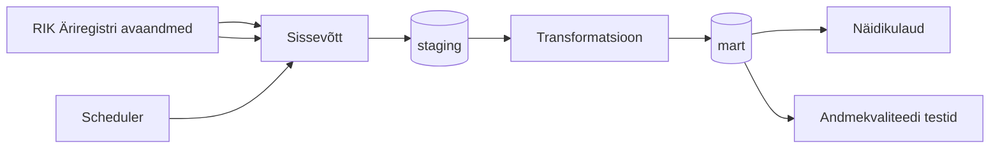

# Arhitektuur

> **Juhend:** See fail on projektitöö esimese nädala väljund. Asenda kõik nurksulgudes plankid oma projekti tegeliku sisuga. Kustuta see juhendrida.

## Äriküsimus

Kui palju on maksuvõlas ettevõtteid, mille juhatus on muutunud viimase päeva jooksul ning milline on nende ettevõtete maksuvõla kogusumma päevase seisuga, jaotatuna võla vanuse gruppidesse (kuni 2 kuud, 2-5 kuud, 6-11 kuud, ≥ 1 aasta)?

## Mõõdikud

1. Juhatuse muutus - ettevõttel loetakse juhatuse muutus toimunuks, kui võrreldes eelmise päeva (või viimase olemasoleva kuupäeva) andmetega:
lisandus vähemalt üks uus juhatuse liige või
vähemalt ühe varasema juhatuse liikme seos lõppes.
2. Võla vanus päevades - arvutatakse EMTA maksuvõla avaandmetes veergude "Andmed on seisuga" ja "vanima tasumata nõude tasumise tähtpäev" vahe päevades.
3. võla vanuse grupp - maksuvõla vanuse päevade vahemik, klassifitseerituna: 1–59 päeva (kuni 2 kuud),
60–179 päeva (2–5 kuud),
180–364 päeva (6–11 kuud),
≥ 365 päeva (≥ 12 kuud / 1 aasta).

## Andmeallikad

| Allikas | Tüüp | Ajas muutuv? | Roll |
|---------|------|--------------|------|
| EMTA maksuvõla avaandmed (https://ncfailid.emta.ee/s/XKJLjtynFeYdGyC/download/maksuvolglaste_nimekiri.csv) | CSV | Jah, 1 kord päevas | sisend ettevõtete maksuvõla olemasolu ja selle vanuse tuvastamisel |
| RIK Äriregistri avaandmed, kaardile kantud isikud (https://avaandmed.ariregister.rik.ee/sites/default/files/avaandmed/ettevotja_rekvisiidid__kaardile_kantud_isikud.json.zip)| JSON | Jah, 1 kord päevas | sisend juhatuse liikmete seoste ja nende muutuste tuvastamisel |

## Andmevoog

> Täpsusta diagrammi vastavalt oma projektile — lisa rohkem andmeallikaid, mudeleid või teenuseid.

## Andmebaasi kihid

| Kiht | Roll |
|------|------|
| `staging` | Hoiab allika andmeid töötlemata kujul. |
| `intermediate` | Puhastatud, ühtlustatud ja rikastatud andmed. |
| `mart` | Hoiab transformeeritud ja ärilogikat sisaldavaid tabeleid. |

## Tööjaotus

| Roll | Vastutus | Täitja |
|------|----------|--------|
| Andmeallika omanik | Kirjutab sissevõtu loogika ja hoiab failide allalaadimise töös | Andrus |
| Transformatsioonide omanik | Kirjutab mart kihi mudelid ja mõõdikute arvutuse | Andrus/Külli/Tuuli |
| Kvaliteedi omanik | Kirjutab testid ja vaatab läbi ebaõnnestunud kontrollid | Tuuli/Külli |
| Näidikulaua omanik | Ehitab näidikulaua, visualiseeringud seotuna äriküsimusega | Külli/Tuuli |

## Riskid

| Risk | Mõju | Maandus |
|------|------|---------|
| Risk 1 — EMTA andmed ei uuene | Puudulikud või valed tulemused | Viimase saadaoleva snapshoti kasutus |
| [Risk 2 -  RIK andmed ei uuene] | Puudulikud või valed tulemused | Viimase saadaoleva snapshoti kasutus |
| [Risk 3 - võla summa puudub] | ei klassifitseeru võlaga ettevõtteks | Kui viimases saadaolevas snapshotis võla vanus puudus, jätab ettevõtte kirje järgmisse kihti (intermediate) lisamata |

## Privaatsus ja turve

Kasutatakse ainult avalikke andmeid (avaandmed), mis ei vaja eraldi kaitset. Isikuandmeid (juhatuse liikmete nimed) ei ekspordita analüütilisse kihti. Andmebaasi ligipääsuandmed hoitakse .env failis
[Kirjelda, millised isiku- või tundlikud andmed teie projektis esinevad (kui üldse) ja kuidas neid kaitsete. Isikuandmed peavad olema anonümiseeritud. Andmebaasi paroolid peavad tulema `.env` failist.]
